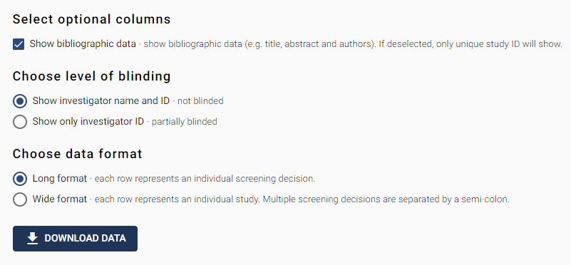
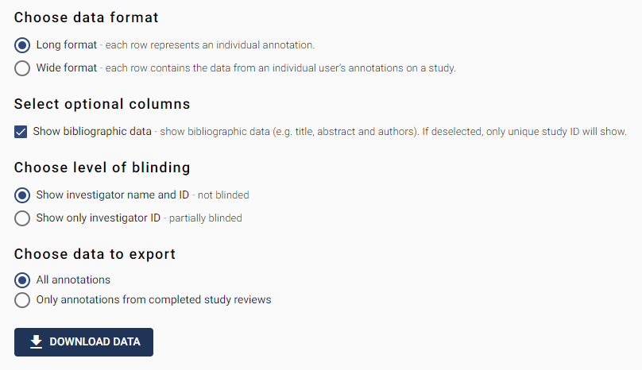

# Exporting Data

Once your annotations are complete, you will need to export them for analysis. 

SyRF provides project administrators the possibility to export their studies and associated data from their project. This is available in the “Data Export” tab in the Navigation Bar. There are 3 data-types that can be exported.

## Bibliographic  

This section allows you to export the bibliographic information about the studies in your SyRF project. Bibliographic information refers to the following fields: Unique SyRF StudyId, Title, Authors, Publication Name (Journal title), Alternate Name, Abstract, Url, Author Address, Year,DOI, ReferenceType, Keywords, PDFRelativePath (where the PDF can be found), DateTimeCreated, Systematic Search Id, Systematic Search Name.  

### Choose data to export  

In this section, select which studies you want to export. 

You have two options:  

1. All studies uploaded to this project – this will export all studies that are in this project, regardless of status.  

2. Only studies included by screening – this will export only studies that have a reconciled decision of “Included” or relevant to the research question.  
 
Clicking the “Download data” button will download your data to your local computer. Please note, this may take some time depending on the size of the file. Please do not navigate away from this page until the data file has been downloaded.  

### Systematic Search Import Compatibility

This tick box allows you to control whether columns containing SyRF internal identification numbers are included. If ticked, study ID, Search ID, Search name, and Custom ID will be omitted, allowing the data to be directly imported into a new SyRF project.
 
## Screening 

This section allows you to export screening data for the studies in your SyRF project. 

### Select optional columns  

This tick box allows you to control whether bibliographic data is included in the data downloaded. The default option is to include bibliographic data (e.g. title, abstract and authors). If deselected, only unique study ID will show. 

### Chooses level of blinding  

In this section, select whether you want to be aware of which reviewer made the screening decision or not. 

You have two options:  

1.  Show investigator name and unique ID – this option displays the full name and unique SyRF ID for each SyRF user that has made a screening decision on each article. This option means you will be not be blinded to screening decision.   

2. Show only investigator unique ID – this option ONLY displays the unique SyRF ID for each SyRF user that has made a screening decision on each article. This option means you will be partially blinded to who has made screening decisions for each article. It is possible to find out which unique SyRF ID belongs to which SyRF user at a later date.  
 
### Choose data format 

In this section, select which format you would like your data in. This refers to long or wide format.  

You have two options:  

1.  Long format – Mostly useful if you plan to programmatically interact with your data (e.g. using R).  In long format, data are presented in a normalised format where each row represents an individual screening event.  

2.  Wide format – Mostly useful to gain a visual overview of your data (e.g. in excel). In the wide format, each row represents information for a unique study in your SyRF project, with multiple screening decisions separated with a semi-colon. 

 
## Annotation  

### Export annotations 

In this section, select which stage you want to export annotations for. 
 
#### Select a stage 

This dropdown menu allows you to select which stages of your review you would like to download data for. By default, all stages are selected. Click on the dropdown menu to see a list of the stages in your project. You can select/deselect specific stages by ticking/unticking the checkboxes next to each stage.  

 
#### Select a level 

This dropdown menu allows you to select which level of annotations you would like to download data for. 

Your options are:  

    Study 

    Disease Model Induction  

    Treatment  

    Outcome Assessment  

    Cohort 

    Experiment  

### Choose data format 

In this section, select which format you would like your data in. This refers to long or wide format.  

You have two options:  

1. Long format – Mostly useful if you plan to programmatically interact with your data (e.g. using R).  In long format, data are presented in a normalised format where each row represents an individual annotation. N.B. If you have many annotation questions in your project, this will result in a large number of rows.   

2. Wide format – Mostly useful to gain a visual overview of your data (e.g. in excel). In the wide format, each row contains the data from an individual user’s annotation session.  

Split annotations 

When you have all stages selected, and you choose wide format, an additional checkbox appears called “Split annotations by stage”. Clicking this option will alter the format of the data output and annotation sessions from different stages will be shown on separate rows.  

### Select optional columns  

This tick box allows you to control whether bibliographic data is included in the data downloaded. The default option is to include bibliographic data (e.g. title, abstract and authors). If deselected, only unique study ID will show. 

### Chooses level of blinding  

In this section, select whether you want to be aware of which reviewer made the screening decision or not. 

You have two options:  

1.  Show investigator name and unique ID – this option displays the full name and unique SyRF ID for each SyRF user that has made a screening decision on each article. This option means you will be not be blinded to screening decision.   

2. Show only investigator unique ID – this option ONLY displays the unique SyRF ID for each SyRF user that has made a screening decision on each article. This option means you will be partially blinded to who has made screening decisions for each article. It is possible to find out which unique SyRF ID belongs to which SyRF user at a later date.  

### Choose data to export  

In this section, select which studies you want to export. 

You have two options:  

1. All annotations – this will export annotations for all studies that are in this project.  

2. Only annotations from completed study reviews – this will export annotations only for studies that have been marked as completed by reviewers. 
