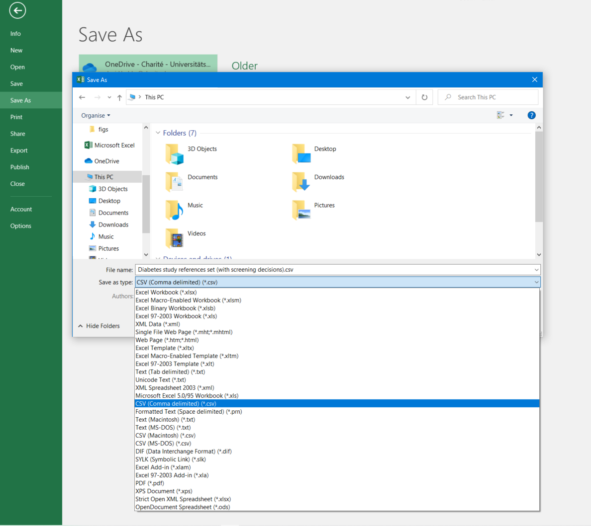

# Uploading Systematic Search Results

This guide explains how to upload your systematic search results into a SyRF project. Proper preparation and formatting are crucial for a successful upload.

## Before You Upload: Deduplication

If you searched multiple databases, your results likely contain duplicate studies. **SyRF does not currently perform deduplication.** You must remove duplicates *before* uploading your search results.

* **Recommended Tool:** Use the [ASySD deduplication tool](https://camarades.shinyapps.io/ASySD/) to automate this process.

## Uploading Your Search File

Only **Project Administrators** can upload systematic searches.

1. Navigate to your project.
2. Go to **Project Settings**.
3. Select **Systematic Searches**.
4. Click **Upload New Systematic Search**.

### Supported File Formats

You can upload your systematic search results as either:

* **EndNote Desktop XML (`.xml`)**: Recommended for users managing references in EndNote Desktop.
* **Comma Separated Value (`.csv`)**: Suitable for spreadsheets or exports from other reference managers (like Zotero). Allows optional inclusion of pre-existing screening decisions.

**Important:** SyRF only accepts XML files exported from **EndNote Desktop**. EndNote Web XML files are *not* supported.

### Option 1: Using EndNote XML

Follow these steps to export your references from EndNote Desktop:

1. **Import References:** Ensure all references for screening are in your EndNote library.
2. **(Optional) Find Full Text:** Highlight all references (`Ctrl`+`A` or `Cmd`+`A`), then go to `References` -> `Find Full Text` to attach PDFs if desired.
3. **Select References:** Highlight *all* references you want to export (`Ctrl`+`A` or `Cmd`+`A`). *Warning: If you don't select all, EndNote might only export the first reference.*
4. **Export:** Go to `File` -> `Export`.
5. **Set File Type:** Change the `Save as type` or `Format` to `XML (*.xml)`.
6. **Save:** Name and save your XML file. This file is now ready for upload to SyRF.

> **Using Zotero?**
> You *cannot* use Zotero's 'EndNote XML' export option for SyRF. If using Zotero, export your library as a CSV file and follow the CSV upload instructions below.

> **Getting an Error During XML Upload?**
> Check the [SyRF FAQ](https://syrf.org.uk/faq) for common issues and solutions.

### Option 2: Using a Spreadsheet (CSV)

You can prepare your study list in a spreadsheet program (like Microsoft Excel or Google Sheets) and save it as a `.csv` file.

1. **Prepare Your Spreadsheet:** Create a spreadsheet with your study references.
2. **Required Column Headings:** Your file **must** include the following column headings exactly as written, even if you don't have data for every column:
    * `Title`
    * `Authors`
    * `PublicationName`
    * `AlternateName`
    * `Abstract`
    * `URL`
    * `AuthorAddress`
    * `Year`
    * `DOI`
    * `ReferenceType`
    * `Keywords`
    * `PDFRelativePath` (See [Uploading Full-Text PDFs](#uploading-full-text-pdfs) section below)
    * `CustomID`

    > **Download Template:** You can download a template with the correct headings and example data [here](https://syrf.org.uk/assets/pdfs/Example_systematic_search_upload.csv).

3. **Empty Fields:** SyRF accepts empty cells for any of the required columns if data is unavailable. **Do not delete the columns themselves.**
4. **(Optional) Include Screening Decisions:**
    * To upload screening decisions made outside SyRF, add a separate column for *each screener* whose decisions you want to import.
    * Name these columns descriptively (e.g., `Screener_Alice_TitleAbstract`, `Screener_Bob_FullText`). You will map these columns to SyRF users during the upload process.
    * Use `1` for **inclusion** and `0` for **exclusion** within these columns. Empty cells will be ignored.
5. **Remove Extra Columns:** Your file should *only* contain the required columns listed above, plus any columns designated for screening decisions. Extraneous columns can cause invalid data or the upload to fail.
6. **Save as CSV:**
    * In your spreadsheet software, choose `File` -> `Save As` or `File` -> `Download`.
    * Select the file type **CSV (Comma delimited) (\*.csv)**.

    

## Uploading Full-Text PDFs

You can link full-text PDFs to your studies during the initial upload or add them later using the [Bulk Study Update feature](#bulk-study-update-feature).

### Linking PDFs in Your Upload File

1. **Organize PDFs:** Place all your PDF files, nested or otherwise, into a single root folder.
2. **Use Relative Paths:** In your upload file (EndNote XML or CSV), the `PDFRelativePath` column/field must contain the *relative path* from the root of your PDF folder to the specific PDF file for each record.
    * *Example:* If your main folder is `My_Project_PDFs` and a PDF is inside a subfolder `Included_Studies` named `Smith_2020.pdf`, the relative path would be `Included_Studies/Smith_2020.pdf`.
    * For more on relative vs. absolute paths in EndNote, see [EndNote's guide](https://support.clarivate.com/Endnote/s/article/EndNote-Attaching-PDF-files-in-EndNote-desktop-library?language=en_US).
3. **Ensure Consistency:** The PDF folder structure must exactly match the relative paths specified in your upload file.

### Final Step: Sending PDFs to SyRF

**This step is crucial for PDFs to be accessible within SyRF.**

1. After successfully uploading your XML or CSV file containing the relative paths:
2. **Compress your PDF folder** (e.g., into a `.zip` file).
3. **Share the compressed folder** with the SyRF team via a secure file-sharing service (like Google Drive, Dropbox, OneDrive).
4. **Email the SyRF Helpdesk:** [Contact us](mailto:helpdesk@syrf.org.uk) with:
    * Your SyRF **Project Name**.
    * A **link** to the shared folder containing your PDFs.
    * Confirmation that the relative paths are included in the systematic search file you uploaded.

The SyRF team will upload the PDFs to the database, linking them to your studies based on the provided paths. Once processed, PDFs can be opened directly from the study review page.

### PDF File Naming Conventions

* **Avoid Invalid Characters:** Do not use characters like `< > : " \ / | ? *` in your PDF filenames, as they can cause errors.
* **EndNote Default Naming:** Be aware that EndNote's default PDF naming (often using Author/Title) might introduce invalid characters. Consider changing EndNote's settings to rename PDFs using a unique, clean field like `RecordID`.
* See [EndNote's guide on renaming PDFs](https://support.clarivate.com/Endnote/s/article/Rename-PDFs-in-EndNote?language=en_US) for more information.

> **Two-Stage Reviewing & PDFs:**
> If you only need PDFs for studies included after title/abstract screening, you can upload your initial search without PDF paths. After the initial screening stage, retrieve PDFs using your preferred means (e.g., EndNote). You can then use the [Bulk Study Update feature](#bulk-study-update-feature) to add `PDFRelativePath` information *only* for the included studies, then contact the SyRF team with the relevant PDFs. The PDFs will be uploaded and linked, making them accessible in subsequent stages from the review form.

## Viewing Uploaded Studies

After a successful upload, you can view your studies:

1. Click **Studies** in the left-hand navigation panel.
2. Select **All Studies**.

This table displays all studies currently in your project.

## Bulk Study Update Feature

This feature allows you to modify existing studies in your project *after* the initial upload. You can update:

* PDF Relative Paths (`pdfRelativePath`)
* Custom IDs (`customId`)
* Screening Decisions

**How to Use Bulk Update:**

1. Navigate to **Studies** -> **All Studies**.
2. Click the **three dots icon** (...) next to the search magnifying glass.
3. Select **Bulk study update...**.

**Preparing Your Update File (CSV):**

1. **Create a CSV File:** Start a new spreadsheet or modify an export.
2. **Required `studyId` Column:** Your file **must** include a column named `studyId` containing the unique SyRF ID for each study you want to update.
    * **To get SyRF Study IDs:** Go to `Data Export` -> `Bibliographic`. Ensure "SyRF systematic search import compatible format" is *un*ticked. Click `DOWNLOAD DATA`. This file will include the `studyId` column along with the other current bibliographic data.
3. **Include Only Columns to Update:** Besides `studyId`, your file should *only* contain columns for the data you wish to change (e.g., `pdfRelativePath`, `customId`, and/or screening decision columns). Remove any other bibliographic columns from the export file to avoid errors.
4. **Enter Update Values:**
    * **For `pdfRelativePath` or `customId`:** Enter the new value in the corresponding cell for each study you want to update. **Note:** Erasing a value in these columns *will erase* the existing value for that study property in SyRF.
    * **For Screening Decisions:**
        * Add columns named descriptively for each screener and stage (e.g., `Screener_Alice_TitleAbstract`, `Screener_Bob_FullText`).
        * Use `1` for inclusion and `0` for exclusion.
        * **Note:** Leaving a cell blank in a screening column *will be ignored*; it will not erase existing decisions. However, new screening decisions will overwrite previous ones for the same user and study.

**Upload Process:**

1. **File Selection:** Choose the prepared CSV update file.
2. **Column Mapping:**
    * SyRF will show the columns it detected. Review this carefully. If unexpected columns appear, fix your CSV file and re-upload.
    * If you included screening decision columns, map each column to the corresponding project member and screening stage.

    

3. **Review & Upload:**
    * A final confirmation screen shows the detected columns and screening mappings.
    * **Read the warnings carefully:**

        > **Warning: Bulk updates cannot be undone.** Changes made here are permanent.
        >
        > * **`pdfRelativePath` & `customId`:** Data in your update file *will overwrite* existing data in SyRF. Blank cells in your file *will erase* existing data for these fields.
        > * **Screening Decisions:** Decisions in your update file *will overwrite* existing decisions *by the same user for the same study and stage*. Blank cells in screening columns are *ignored* and will not erase existing decisions.

    * Double-check your file before confirming the upload.

    

## Deleting Systematic Searches

You can delete an entire systematic search upload from your project via **Project Settings** -> **Systematic Searches**.

> **Warning:** Deleting a systematic search is **irreversible** and will permanently remove:
>
> * All studies included in that upload.
> * All screening decisions associated with those studies.
> * All data annotation answers associated with those studies.
>
> **Proceed with extreme caution.**

---
