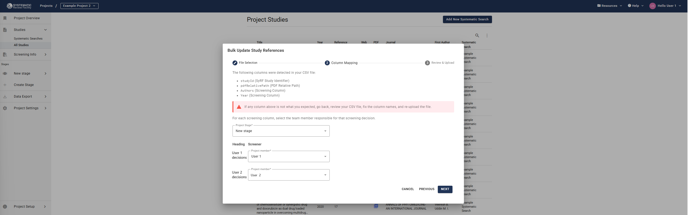

# Systematic Search Upload Guide

 

<!--- YouTube Help Video --->

    <iframe src="https://www.youtube.com/embed/e6blmlaPrNA?list=PLT9yacSnQZW85roKzVqoC11OiXm9pob-4"
            title="Systematic Search Upload Guide"
            frameborder="0"
            allow="accelerometer; autoplay; clipboard-write; encrypted-media; gyroscope; picture-in-picture; web-share"
            allowfullscreen>
    </iframe>

 

## Preparing Your Search Results

### Deduplication
SyRF does not support deduplication directly. If your search spans multiple databases, you must remove duplicates **before** uploading. Use the [ASySD Deduplication Tool](https://camarades.shinyapps.io/ASySD/) for automatic deduplication.

---

## Uploading Your Files

### Accepted File Formats
SyRF supports systematic search uploads in two formats:
- **EndNote XML (Desktop only)**
- **CSV (Comma-separated values)**

SyRF does **not** support XML exports from EndNote Web or Zotero.

### EndNote XML Upload Instructions

**Without Screening Decisions:**
1. Import all references into EndNote.
2. Highlight all references (`Ctrl+A`), then click **References → Find Full Text** to locate PDFs.
3. Highlight all references again (`Ctrl+A`), and select **File → Export**.
4. Choose **XML** as the file type and save your file.

**Troubleshooting Upload Issues:** [Visit the FAQ](https://syrf.org.uk/faq)

### CSV Upload Instructions

**With Optional Screening Decisions:**
1. Prepare your spreadsheet with the **required column headers** exactly as listed below:
   - Title, Authors, PublicationName, AlternateName, Abstract, URL, AuthorAddress, Year, DOI, ReferenceType, Keywords, PDFRelativePath, CustomID

   [Download an Example CSV Template](https://syrf.org.uk/assets/pdfs/Example_systematic_search_upload.csv)

2. Include all column headers listed above, even if some columns are empty.
3. To include **screening decisions**, add separate columns for each user. Use:
   - `1` for inclusion
   - `0` for exclusion

4. Ensure **no additional or missing columns** are in your spreadsheet to avoid upload errors.
5. Save your file as **CSV (Comma delimited)** using Excel or similar software:

---

## Linking and Uploading Full-Text PDFs

If linking PDFs, ensure:
- Your CSV or XML file includes a column named **PDFRelativePath** containing paths relative to your PDF folder.
- PDF filenames avoid invalid characters (`< > : " \ / | ? *`).

[Learn more about relative paths in EndNote](https://support.clarivate.com/Endnote/s/article/EndNote-Attaching-PDF-files-in-EndNote-desktop-library?language=en_US)

**To Upload PDFs:**
1. Prepare a folder containing all PDFs matching your systematic search.
2. Provide a CSV file clearly linking each PDF to the study title or SyRF study ID.
3. [Contact the SyRF Helpdesk](mailto:helpdesk@syrf.org.uk) and share your project details and PDF folder via Google Drive or a similar service.

**Two-stage Screening:** [Visit the FAQ](https://syrf.org.uk/faq)

[Learn more about renaming PDF files in EndNote](https://support.clarivate.com/Endnote/s/article/Rename-PDFs-in-EndNote?language=en_US)

---

## Viewing and Managing Studies

### Viewing Uploaded Studies
Access studies by navigating to **Studies → All Studies** from the left-hand panel.

### Bulk Study Update
You can bulk-update properties such as:
- PDF relative paths
- Custom IDs
- Screening decisions

**Bulk Update Instructions:**
1. Navigate to **Studies → All Studies**.
2. Click the three dots (⋮) near the magnifying glass icon and select **Bulk study update**.
3. Select a CSV file with updates.
   - CSV must contain `Study ID` plus at least one of: `pdfRelativePath`, `customId`, or screening decision columns.
4. Map columns for screening decisions to project members and stages.

**Important Considerations:**
- This action **cannot be undone**.
- Blank values overwrite existing data for `pdfRelativePath` and `customId`.
- Blank fields in screening columns are ignored; existing decisions persist unless updated.

Double-check your CSV file before proceeding.

---

## Deleting Systematic Searches

Systematic searches can be deleted via SyRF settings. **Warning:** This permanently deletes associated screening decisions and annotations. Proceed with caution.

