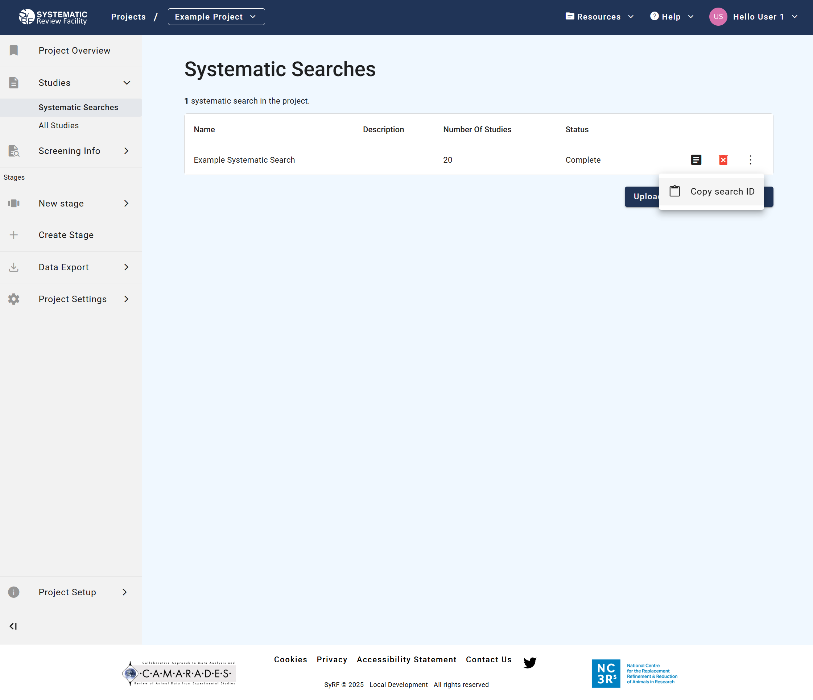

# Managing Full-Text PDFs

You can link full-text PDFs to the studies in SyRF. This allows reviewers to access the full text directly during screening or data extraction. PDFs are linked using the `PDFRelativePath` field/column in your upload file and then uploaded separately to SyRF storage.

**Contents**

* TOC
{:toc}

---

## 1. Linking PDFs via the `PDFRelativePath` Field

1. **Organize PDFs:** Create a main folder on your computer to hold all the PDF files for this Systematic Search. You can organize PDFs into subfolders within this main folder if desired (e.g., `MyProject_PDFs/Included/Smith_2020.pdf`).
2. **Determine Relative Paths:** For each reference in your `.xml` or `.csv` file that has a corresponding PDF, you need to specify its path *relative* to the main PDF folder you created.
    * The `PDFRelativePath` field/column must contain this relative path.
    * *Example:* If your main folder is `MyProject_PDFs` and a PDF is located directly inside it named `Jones_2021.pdf`, the `PDFRelativePath` is `Jones_2021.pdf`.
    * *Example:* If the PDF is in a subfolder `SubfolderA` within the main folder, named `Bloggs_2019.pdf`, the `PDFRelativePath` is `SubfolderA/Bloggs_2019.pdf`. Use forward slashes `/` as separators.
    * **EndNote Users:** EndNote can manage relative paths. Ensure your EndNote settings correctly store relative paths if you intend to use this feature. See [EndNote's guide on file attachments](https://support.clarivate.com/Endnote/s/article/EndNote-Attaching-PDF-files-in-EndNote-desktop-library?language=en_US) for details on relative vs. absolute paths.
3. **Ensure Consistency:** The folder structure on your computer *must exactly match* the relative paths specified in your upload file. The filename (including extension `.pdf`) must also match precisely.

## 2. Sending PDFs to SyRF

**This is a separate, manual step required after uploading your reference file.**

1. **After** successfully uploading your `.xml` or `.csv` file containing the `PDFRelativePath` information:
2. **Compress:** Compress the *entire main PDF folder* (the one containing all your PDFs and subfolders, matching the structure used for relative paths) into a single compressed file (e.g., `.zip`, `.7z`).
3. **Share:** Upload this compressed folder to a secure file-sharing service (e.g., Google Drive, Dropbox, OneDrive, institutional file share).
4. **Notify SyRF:** Email the SyRF Helpdesk ([helpdesk@syrf.org.uk](mailto:helpdesk@syrf.org.uk)) with the following information:
    * The **email address** you used to create your SyRF account.
    * **Project IDs** [found on the project overview page](./nav-project-overview.html#project_ids).
    * **Project Name**
    * **Search ID:**
    > *How to find it:*
    1. Go to the **Systematic Searches** page within your SyRF project. You can find this under the **Studies** section in the left-hand navigation panel.
    2. This page lists all your systematic searches. Locate the specific search you need the ID for.
    3. To the right of that search entry, click the **three dots icon**.
    4. An option labelled "**Copy search ID**" will appear (as shown in the image below). Click it to copy the ID to your clipboard.
    

    * A **shareable link** to the compressed folder containing your PDFs. Ensure the link provides access permission to the SyRF team.
    * Confirmation that your recently uploaded Systematic Search file (`.xml` or `.csv`) includes the correct `PDFRelativePath` data matching the structure in the compressed folder.

The SyRF team will then process your request, upload the PDFs to secure storage, and link them to the corresponding studies in your project using the relative paths provided. Once processed, linked PDFs can be opened directly from the study review page within SyRF.

## 3. PDF File Naming Conventions and Best Practices

* **Avoid Invalid Characters:** Do not use the following characters in your PDF filenames as they can cause issues with storage and linking: `< > : " \ / | ? *`
* **EndNote Default Naming:** Be aware that EndNote's default PDF renaming often uses fields like Author, Year, Title, which might introduce invalid characters (like colons). Consider configuring EndNote to rename PDFs using a unique and clean field, such as `RecordID`, to avoid potential problems. See [EndNote's guide on renaming PDFs](https://support.clarivate.com/Endnote/s/article/Rename-PDFs-in-EndNote?language=en_US).

## 4. Handling PDFs for Multiple-Stage Reviews

If you only need full-text PDFs for studies that pass an initial title/abstract screen, follow this workflow:

1. **Initial Upload:** Upload your Systematic Search `.xml` or `.csv` file **without** filling in the `PDFRelativePath` field (leave it blank or omit PDF information).
2. **First Stage Screening:** Perform title and abstract screening within SyRF.
3. **Identify Relevant Studies:** Determine which studies have passed the first stage and require full-text review.
4. **Gather PDFs:** Obtain the full-text PDFs only for these selected studies. Organize them into a folder structure as described above.
5. **Update Paths via Bulk Update:** Use the [Bulk Study Update feature](manage-studies.html#using-the-bulk-study-update-feature) to add the correct `PDFRelativePath` information *only* for these specific studies. You will need their SyRF `studyId`s.
6. **Send PDFs:** Compress the folder containing *only these relevant PDFs* and [send the link to the SyRF Helpdesk](#2-sending-pdfs-to-syrf) as described previously.

This targeted approach ensures PDFs are available when needed for full-text review, annotation, or data extraction stages.

---

## Related Pages

* **[Upload Search](upload-search.html)** - How to upload your systematic search file
* **[Manage Studies](manage-studies.html)** - Bulk updates and post-upload management
* **[View Studies](study-management.html#11-view-studies-in-a-systematic-search)** - How to view your uploaded studies
