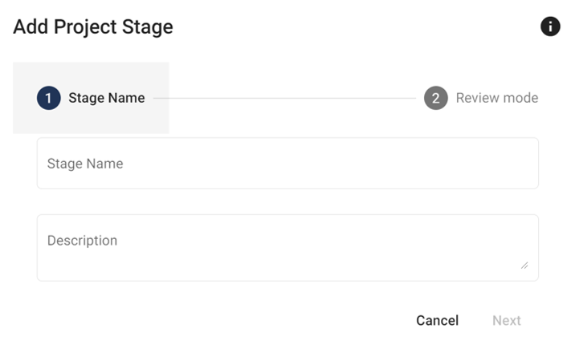

# Project Stages

## What Are Stages?
Stages are sections of your SyRF projects that you add to perform tasks such as screening and data annotation. You can have screening and annotation as separate stages and you can also have screening and annotation in the same stage.

## Add a Stage
You can add a stage via the left-hand side nagivation bar in your SyRF project or by clicking "add stage" on the project overview page.

Once you have added a stage, you can include it in your project by changing the setting to "Active" in the top right-hand corner of the stage page.

## Stage With Screening
By adding screening to your stage, you can screen the studies you have uploaded to your SyRF project using the inclusion/exclusion criteria you entered when creating your project. Currently, as inclusion/exclusion criteria are defined at the project level, you can only screen according to one set of inclusion/exclusion criteria.

## Stage With Annotation
A stage with annotation allows you to annotate data from your study, according to pre-defined questions in your systematic review protocol. SyRF has a question builder tool to allow you to design questions for your project.

Once you have designed all annotation questions, you should specify the stage at which you want to answer each question. You can do this before you start screening or after you have finished screening.

To add questions to your stage of interest go to the ‘Stages’ section of your project homepage and click ‘Enter Stage’. You will then need to click on ‘Stage Design’ to start editing the stage.

### Data Extraction
To extract data from graphs in your systematic review studies, you will have to turn on data extraction in addition to annotation within your stage.

## Screening and Annotating Within the Same Stage
If you want to carry out screening and annotation at the same time, you will also need to have these functionalities turned on (e.g. even if you have screened at a separate stage, you might want to have the functionality of being able to exclude a study at a later time point when you have read the full-text).

You will then be able to select the questions that you want to be included in this stage by checking the box next to the relevant questions.

