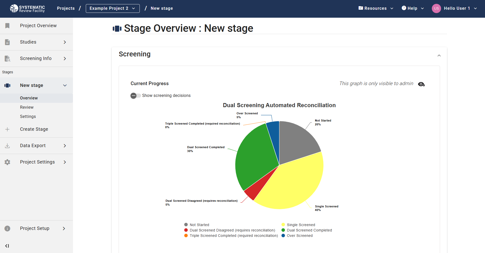

# Project Overview 

Monitor project progress, including screening and annotation completion levels, in the Overview tab under each stage in the left-side menu.

## Screening stage 

### Dual screening 

Two chart views are available: 

- Without “Show screening decisions” - Displays the proportion of studies at different screening stages:

    - Not screened
    - Screened by 1 or 2 reviewers
    - Reconciled
    - Over screened

- With “Show screening decisions” - Adds inclusion/exclusion details and disagreement proportions in over screened studies.

Hover over any pie chart slice for exact study counts.

     

### Screening Leaderboard

Below, the "Screening Leaderboard" table provides detailed screening activity per user.

### Single screening 

Similar charts are available for single screening:

- Basic view – Displays studies that are:
    - Not Screened
    - Screened once
    - Over Screened

- Detailed view – Includes screening decisions

## Annotation stage 

Two chart views are available:   

- Without "Show all" – Shows the proportion of studies with:

    - 0 Completed Reviews
    - 1 Completed Review
    - 2 Completed Reviews
    - Over Annotated studies

- With "Show all" – Breaks down studies into:
    - Complete (green) sessions
    - Incomplete (orange) sessions; meaning a review was started but not finished

 

Hover over chart slices for detailed counts. When "Show all" is enabled, incomplete session counts are also displayed.

     

### Annotation Leaderboard

Below, the "Annotation Leaderboard" table provides detailed annotation activity per user.

## Review Completion Criteria 

| Without “Show all”         | With “Show all”                                      |
|------------------------|---------------------------------------------------|
| No completed review   | No complete or incomplete session                 |
|                        | 1 incomplete and 0 complete sessions              |
|                        | 2 incomplete and 0 complete sessions              |
| 1 completed review    | 1 complete and 0 incomplete sessions              |
|                        | 1 complete and 1 incomplete sessions              |
| 2 completed reviews   | 2 complete and 0 incomplete sessions              |
| Over annotated        | ≥ 3 complete and 0 incomplete sessions            |
|                        | ≥ 2 complete and ≥ 1 incomplete sessions          |
|                        | ≥ 1 complete and ≥ 2 incomplete sessions          |
|                        | ≥ 3 incomplete and 0 complete sessions            |

This feature is optimised for stages where [the setting](../stage-settings.html) "Required Annotators per Study" is set to 2 (i.e., studies with ≥ 3 annotators count as over annotated).