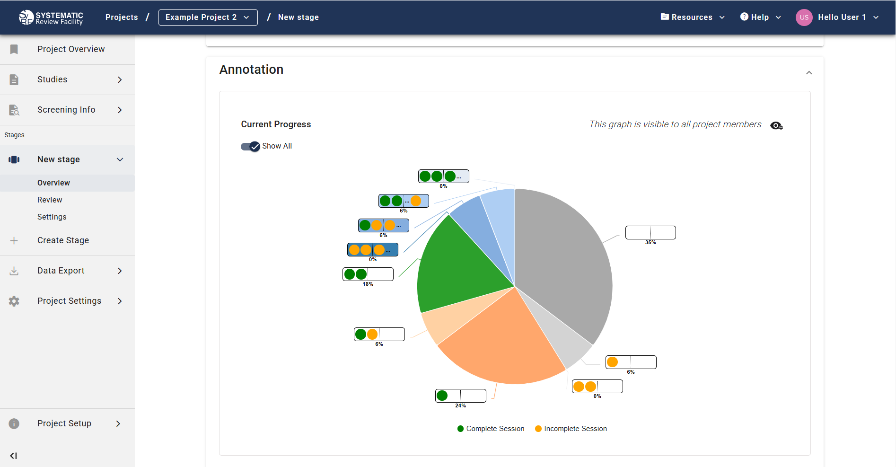

# Project Overview 

You can monitor the progress of the project in the Overview tab, which is found under each stage on the left-side menu.  

## Screening stage 

### Dual screening 

Two chart views are available: 

- Without “Show screening decisions” - Displays project progress by screening stage.

- With “Show screening decisions” - Adds inclusion/exclusion details and disagreements in overscreened studies.

Hover over any pie chart slice for exact study counts.

     

#### Screening Leaderboard

Below, the "Screening Leaderboard" provides individual user screening activity.

### Single screening 

Similar information is available when single screening is selected instead of dual screening. The simplified version of the chart displays the proportion of studies not screened, single screened and overscreened, whereas the detailed version provides additional information on screening decision. 

# Annotation stage 

Two versions of the chart detailing the annotation progress are available to view:  

- When “Show all” is turned off, a simplified version of the chart displays the proportion of studies with 0, 1 or 2 fully completed reviews, as well as overannotated studies.  

- When “Show all” is turned on, the more comprehensive version of the chart displays the proportion of studies with 0, 1, 2 or ≥ 3 complete (green circle) or incomplete (yellow circle) sessions. In this chart, a complete session is equivalent to a fully completed review, whereas an incomplete session refers to a review in progress (a review started and saved but not completed).

 

You can hover over each pie chart slice in both views to get more detailed information on the exact number of studies in each section. When the "Show all" is turned on, you can also see the number of incomplete and/or incomplete sessions for each section.

     

Further down below, you can also see the "Annotation Leaderboard" table, which provides more detailed information on each user's annotation activity.

Studies are considered to have no completed reviews if they have 0 complete sessions or up to 2 incomplete sessions. Studies are considered to have 1 completed review if they have 1 complete session ± 1 incomplete session. Studies are considered to have 2 completed reviews if they have 2 complete sessions. Finally, studies are considered overannotated if they have ≥ 3 complete/incomplete sessions. This is summarised in the table below:  

| “Show all” off         | “Show all” on                                      |
|------------------------|---------------------------------------------------|
| No completed review   | No complete or incomplete session                 |
|                        | 1 incomplete and 0 complete sessions              |
|                        | 2 incomplete and 0 complete sessions              |
| 1 completed review    | 1 complete and 0 incomplete sessions              |
|                        | 1 complete and 1 incomplete sessions              |
| 2 completed reviews   | 2 complete and 0 incomplete sessions              |
| Over annotated        | ≥ 3 complete and 0 incomplete sessions            |
|                        | ≥ 2 complete and ≥ 1 incomplete sessions          |
|                        | ≥ 1 complete and ≥ 2 incomplete sessions          |
|                        | ≥ 3 incomplete and 0 complete sessions            |

This feature is optimised for stages where [the setting](../stage-settings.html) "Required Annotators per Study" is set to 2 (i.e., studies with 3 or more annotators count as overannotated).