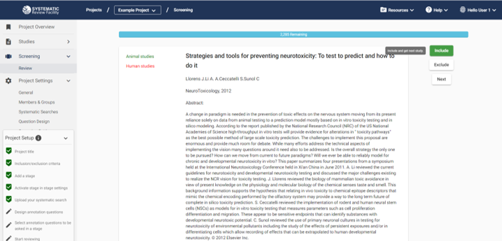

# Screening

 

<!---Link to youtube help video:--->

    <iframe src="https://www.youtube.com/embed/JkkS82a8Msw?list=PLT9yacSnQZW85roKzVqoC11OiXm9pob-4" 
            title="" 
            frameborder="0" 
            allow="accelerometer; autoplay; clipboard-write; encrypted-media; gyroscope; picture-in-picture; web-share" 
            allowfullscreen>
    </iframe>

 

## Screening using SyRF
You can screen the studies in your SyRF project against the inclusion/exclusion criteria you defined in your systematic review protocol and that you specified when you created your project by creating a screening stage in SyRF.

When you start reviewing in a stage with screening enabled, you will be shown the title and abstract of a random study from your systematic search uploads. If you have also uploaded PDFs, there will be a button to allow you to view the PDF.

Use the include and exclude buttons to record whether or not your study meets the inclusion/exclusion critiera. If you are unsure and want to come back to the study, click 'Next' to skip it and move on to another study.

Once you have decided to include or exclude a study, SyRF will record it as completed by you and you will not be shown it again. If you think you have made a mistake, it is possible to click the back button on your browser to go back to your previous study and re-screen it.

### Studies Unavailable to Screen
You will not be presented with studies that have been sufficently screened by other reviewers on the project. Instead, you can see how many studies have been sufficiently screened by other reviewers on your progress bar within the screening stage, marked as 'Unavailable'. Information on how to configure the number of reviewers required to sufficently screen each study can be found in the 'Number of Screeners' section below.

## Number of Screeners
By default, SyRF expects each study to be screened by two indepentent reviewers, with disagreements reconciled by a third reviewer, meaning you need at least three people to screen on your project. SyRF will check which studies have to be reconciled and they will become automatically available to a third person on the project.

If you are doing a student project and don't have other screeners, you can configure your stage to allow single screening in the Stage Settings. This is only recommended for student projects, and not for systematic reviews which you plan on publishing in a scientific journal.

If you wish to manually reconcile your screening disagreements, you can also configure this in the Stage Settings. Please note that this option is not recommended and you will have to contact our Help Desk to help you access your data for manual reconciliation.

**_My project only has two screeners, how can I see screening decisions?_** 
[Check out the FAQ](https://syrf.org.uk/faq)
