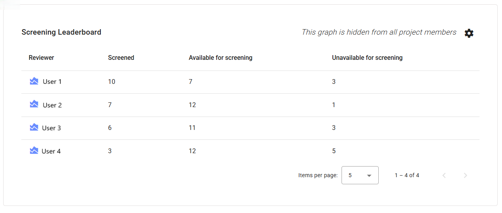
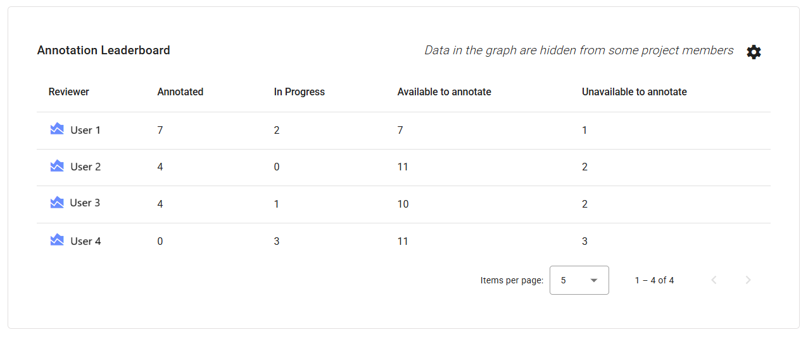

# Stage Overview

The **Stage Overview** page, available within each stage, provides visual dashboards and detailed statistics for that stage's activities. It helps you monitor progress for both screening and annotation tasks (if applicable).

## Screening Progress

This section visualizes the screening progress for studies within the current stage. The specific charts depend on whether the stage is configured for **Dual Screening** or **Single Screening**.

### Dual Screening Mode

When a stage requires two reviewers per study, the following visualizations are shown:

#### Basic View (Pie Chart)

This chart gives a high-level summary of the screening status for all studies in the stage:

* **Not Started:** No screening decisions have been recorded for these studies yet.
* **Single Screened:** One reviewer has completed screening for these studies.
* **Dual Screened Completed:** Two reviewers have screened these studies, and their decisions are in agreement (both included or both excluded).
* **Dual Screened (Disagreement):** Two reviewers have screened these studies, but their decisions conflict. These studies require an additional (third) screening to break the tie.
* **Triple Screened Completed:** A third reviewer has reviewed studies that were previously in disagreement, completing the tie-breaking process.
* **Over Screened:** More than the required number of reviewers (in this case, more than two, or more than three if a disagreement occurred) have screened these studies. This usually happens if screening assignments change or users screen beyond their assigned workload.

#### Detailed View (Pie Chart - "Show Screening Decisions")

Toggling the **"Show screening decisions"** checkbox updates the visualization (in this case, to a detailed pie chart) to provide a more granular breakdown, showing the *outcome* of the screening decisions for different categories:

* **Not Started:** Remains the same.
* **Single Screened Included:** Studies screened by one reviewer, marked for inclusion.
* **Single Screened Excluded:** Studies screened by one reviewer, marked for exclusion.
* **Dual Screened Disagreed (requires tie-break):** Two reviewers have screened with conflicting decisions; a tie-breaking third review is required.
* **Dual Screened Included:** Two reviewers agreed on inclusion.
* **Dual Screened Excluded:** Two reviewers agreed on exclusion.
* **Triple Screened Included:** A tie-breaking third review resolved an initial disagreement, resulting in inclusion. *(Note: The legend might display "(requires reconciliation)" but this status typically indicates the tie-break review is done).*
* **Triple Screened Excluded:** A tie-breaking third review resolved an initial disagreement, resulting in exclusion. *(Note: The legend might display "(requires reconciliation)" but this status typically indicates the tie-break review is done).*
* **Over Screened Included:** More than the required number of reviewers screened, resulting in inclusion.
* **Over Screened Excluded:** More than the required number of reviewers screened, resulting in exclusion.
* **Over Screened Disagreed:** More than the required number of reviewers screened, and their decisions still result in a disagreement state (e.g., requiring further tie-breaking or specific decision rules).

#### Hover Information

Hovering your mouse cursor over any slice in the pie charts reveals the exact number of studies and the corresponding percentage of the total studies in that category.

#### Screening Leaderboard

This table tracks individual user contributions to screening within the stage:

* **Screened:** The number of studies screened by each user.
* **Available:** The number of studies currently available for that user to screen.
* **Unavailable:** The number of studies not currently available for that user to screen (e.g., studies they have already screened, studies not assigned to them, studies awaiting a tie-breaking review, etc.).

### Single Screening Mode

When a stage requires only one reviewer per study, the charts are simplified:

#### Basic View (Pie Chart)

* **Not Screened:** No screening decision recorded.
* **Screened Once:** One reviewer has completed screening.
* **Over Screened:** More than one reviewer has screened the study.

#### Detailed View (Chart - "Show Screening Decisions")

* Toggling this view adds the decision breakdown, showing **Screened Once** studies separated by inclusion vs. exclusion decisions.
* It also shows the decision breakdown for **Over Screened** studies.

## Annotation Progress

If annotation is enabled for the stage, this section visualizes the progress. An **"annotation session"** is tracked per stage and typically refers to one user completing (or partially completing) the annotation form designed for that specific stage for one study.

### Annotation Charts

#### Basic View (Pie Chart)

This chart summarizes the overall annotation completion status per study within the current stage, based on the number of *completed* annotation sessions for this stage:

* **No Completed Reviews:** No user has fully completed this stage's annotation form for these studies. (They may have incomplete sessions for this stage).
* **One Completed Review:** One user has fully completed this stage's- annotation form.
* **Two Completed Reviews:** Two users have fully completed this stage's annotation form. (This typically applies if 2 annotators are required for this stage).
* **Over Annotated:** More than the required number of users have completed annotation for these studies in this stage. (See definition based on stage settings below).

#### Detailed View (Pie Chart - "Show All")

Toggling the **"Show All"** slide toggle updates the visualization to a detailed **Pie Chart**. This chart provides a more granular breakdown by grouping studies based on the combination of **Complete** and **Incomplete** annotation sessions associated with them for the current stage:

* **Complete Sessions (Green icon):** Represent annotation forms for this stage that have been fully filled out and marked as complete by a user for a given study.
* **Incomplete Sessions (Orange icon):** Represent annotation forms for this stage that have been started by a user for a study, saved but not yet marked as complete.

Each slice of the pie chart corresponds to a specific combination of complete/incomplete sessions (e.g., studies with one complete session and one incomplete session, studies with two complete sessions, etc.), showing the distribution across these detailed statuses.

#### Hover Information

Hovering over slices in the annotation pie charts (or bars if applicable in other views) provides exact study counts and percentages, often showing breakdowns of complete vs. incomplete sessions for the detailed view *within this stage*.

### Review Completion Criteria Table

This table explains how the categories in the **Basic View** relate to the counts of **Complete** and **Incomplete** sessions shown in the **Detailed View ("Show All")** *for the current stage*.

| Basic View Category   | Corresponding Detailed Session Status Combinations (within this stage) |
| :-------------------- | :---------------------------------------------------------------------- |
| No completed review   | 0 complete sessions and 0 incomplete sessions                           |
|                       | 0 complete sessions and 1 incomplete session                            |
|                       | 0 complete sessions and 2 incomplete sessions                           |
| One completed review  | 1 complete session and 0 incomplete sessions                            |
|                       | 1 complete session and 1 incomplete session                             |
| Two completed reviews | 2 complete sessions and 0 incomplete sessions                             |
| Over annotated        | ≥ 3 complete sessions                                                   |
|                       | ≥ 2 complete sessions and ≥ 1 incomplete sessions                       |
|                       | ≥ 1 complete session and ≥ 2 incomplete sessions                        |
|                       | 0 complete sessions and ≥ 3 incomplete sessions (if ≥3 users started)   |

**Note:** The categories and the definition of "Over annotated" are based on the stage setting for **"Required Annotators per Study"** for this specific stage. The example table above is optimised for stages requiring **2** annotators. If a stage required 1 annotator, "One completed review" would be the target, and anything more might be considered "Over annotated".

### Annotation Leaderboard

Similar to the screening leaderboard, this table tracks individual user contributions to annotation *within the current stage*:

* **Annotated:** The number of studies for which the user has completed an annotation session *in this stage*.
* **In Progress:** The number of studies for which the user has started but not completed an annotation session *in this stage*.
* **Available:** Studies available for the user to annotate *in this stage*.
* **Unavailable:** Studies not currently available for the user to annotate *in this stage* (e.g., when already sufficiently annotated by others).

