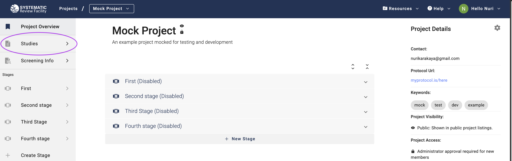
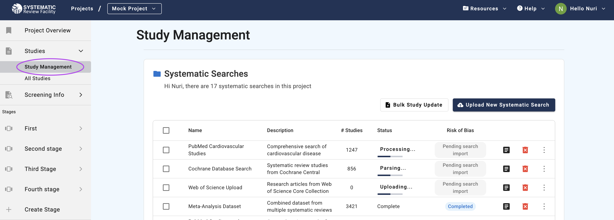
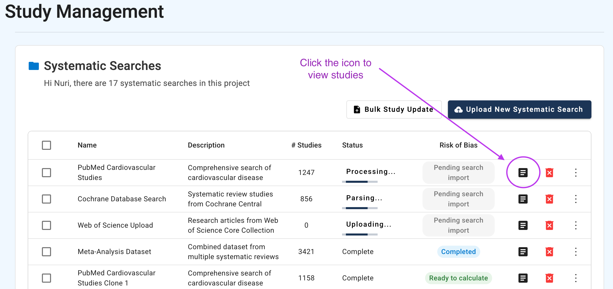
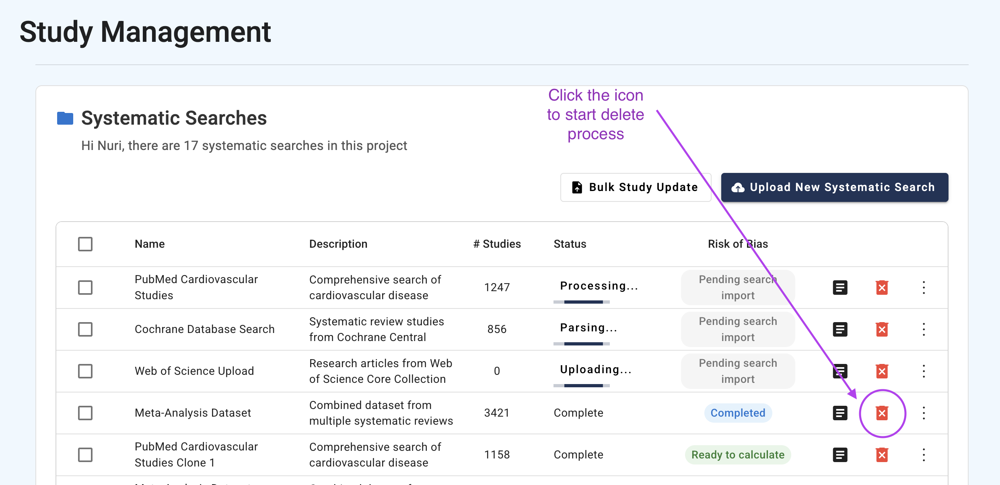
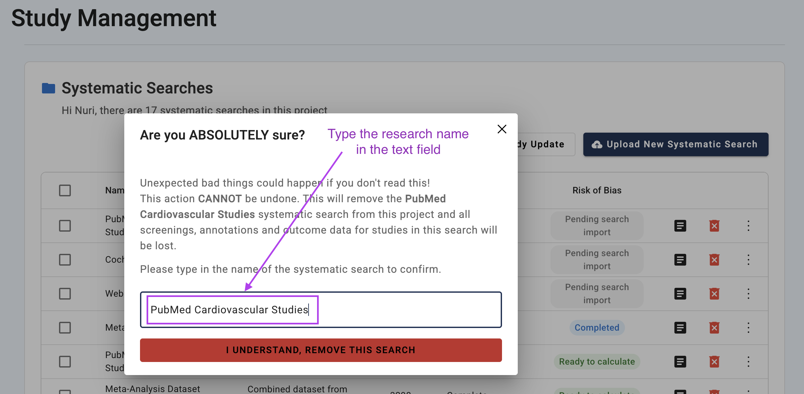
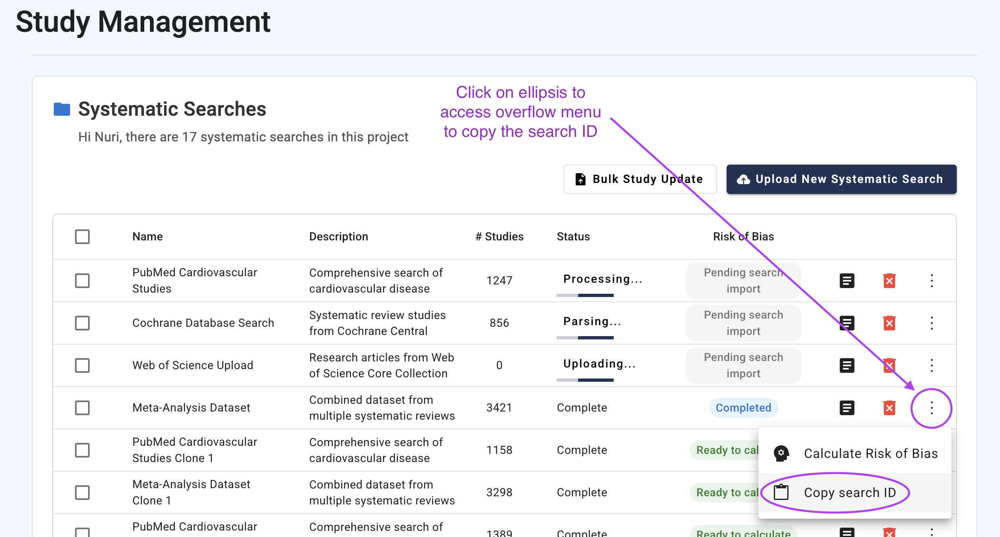
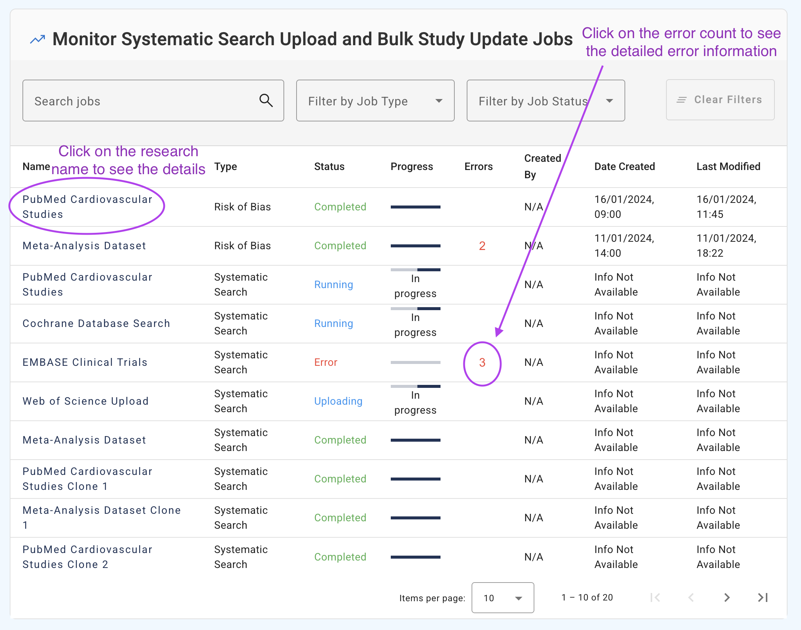
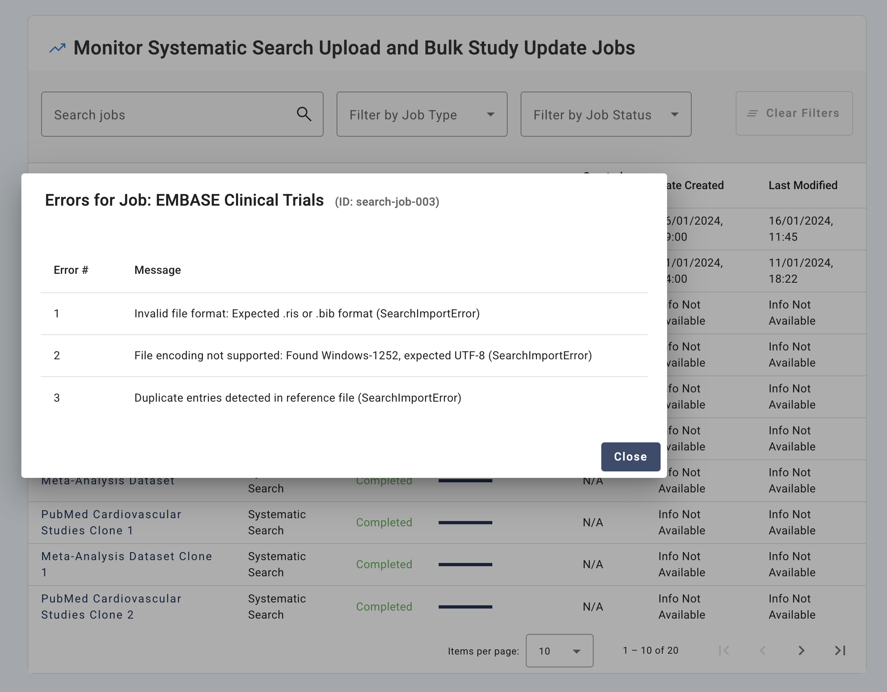

# Study Management

This guide covers how to manage studies in your SyRF project. On the Study Management page, project administrators can upload, organise, monitor, and update study references throughout the systematic review process.

## Accessing Study Management

{: .note }
> **Administrator Access Required:** Study Management features are only available to project administrators.

After selecting a project, click the **Studies** button in the left navigation bar:

{: style="border: 2px solid #ccc; padding:10px;"}

Then click **Study Management** to access the administrative interface:

{: style="border: 2px solid #ccc; padding:10px;"}

## Overview of a Typical Workflow

These are the steps in a typical workflow when working with studies in your SyRF project:

> **Prepare files for systematic search upload**
>
> Start by preparing your CSV or XML files for upload. Learn about file preparation, deduplication, and format requirements in the [Preparing References](prepare-references.html) guide.

> **Upload systematic searches with the prepared files**
> 
> Read the [Systematic Search Upload Process](upload-search.html) for step-by-step instructions on how to upload systematic searches using the CSV or XML files you created.

> **Manage PDFs**
>
> Check [PDF Management](manage-pdfs.html) to learn how you can prepare and submit full-text PDFs to give reviewers access to full text during screening and data extraction. This involves preparing PDF relative paths and coordinating with the SyRF helpdesk to upload the files. 

> **Update data for uploaded studies**
>
> Use [Bulk Study Update](manage-studies.html) to modify existing studies that have been uploaded. This feature is useful for adding or correcting PDF relative path information and custom ID values. You can also upload or modify screening decisions made outside of SyRF, or correct existing screening decisions.

> **Calculate Risk of Bias**
>
> See section [1.3 Run Risk of Bias Assessment](#run-risk-of-bias-assessment) below for detailed instructions on initiating risk of bias calculations.

> **Monitor the background processes**
>
> See sections [2. Risk of Bias Assessment Monitoring](#risk-of-bias-assessment-monitoring) and [3. Job Progress Monitoring](#job-progress-monitoring) below for information on tracking upload progress and background processes. 

## What is Study Management?

The Study Management interface provides you with the tools in the workflow described above. 

{: .note }
> **Important:** Whilst preparing references and managing PDFs are essential parts of study management in SyRF, these steps are performed outside of the Study Management interface itself. Reference preparation happens before upload using external tools, and PDF management involves coordinating with the SyRF helpdesk after upload. We include these steps in this guide because they are crucial prerequisites and follow-up tasks that directly support the study management workflow.

The interface contains three main sections:

### 1. Systematic Searches Table
Your primary workspace showing all uploaded searches with:
- **Action buttons**: Upload new searches and bulk update studies
- **Bulk operations**: Select multiple searches for Risk of Bias calculations
- **Progress indicators**: Real-time status updates with clickable links to detailed progress
- **Overflow menu**: View studies, delete systematic searches, run Risk of Bias assessment for a single search, copy the ID of a search

Two main actions in the Systematic Searches table, [Upload Systematic Search](upload-search.html) and [Bulk Study Update](manage-studies.html), have their dedicated pages, so the guides for these are not included here.

The following actions are performed directly within the Systematic Searches table:

**1.1 View Studies in a Systematic Search**
{: #view-studies}

Click the icon marked in the screenshot to view studies.
{: style="border: 2px solid #ccc; padding:10px;"}

This table displays all studies currently imported into your project. You can sort, filter, and search this list. You can also view the PDFs if available.

**1.2 Delete a Systematic Search**
{: #delete-search}
> **⚠️ Warning:** This action cannot be undone. This will remove the systematic search from this project, and all screenings, annotations and outcome data for studies in this search will be lost.

Click the red delete button (trash icon) in the Actions column: 

{: style="border: 2px solid #ccc; padding:10px;"}

This will open a dialogue box for confirmation. Type the research name into the text field and click Delete to complete the process:

{: style="border: 2px solid #ccc; padding:10px;"}

**1.3 Run Risk of Bias Assessment**
{: #run-risk-of-bias-assessment}
To start a Risk of Bias assessment on a search, use the checkboxes in the first column. You can select a single search, multiple searches, or all searches. When you make a selection, you will see a button with text that shows the number of selected studies (e.g., "2 selected"). Click this button to access the risk of bias assessment options:

{: style="border: 2px solid #ccc; padding:10px;"}

Click the button that shows the number of selected searches (e.g., "2 selected" in the screenshot):
{: style="border: 2px solid #ccc; padding:10px;"}

Now click "Calculate Risk of Bias for Selected" to start the process:
{: style="border: 2px solid #ccc; padding:10px;"}

Alternatively, you can use the ellipsis menu at the end of each row to start the risk of bias calculation:
{: style="border: 2px solid #ccc; padding:10px;"}

**1.4 Copy Systematic Search ID**
{: #copy-search-id}
Click the ellipsis symbol to access the overflow menu and select the button for copying the search ID:
{: style="border: 2px solid #ccc; padding:10px;"}

**1.5 Status Indicators**
{: #status-indicators}

Understanding the status indicators in the Systematic Searches table:

*Uploading:* File transfer is currently in progress. This status is clickable and will show detailed progress information when selected.

*Received:* The file has been received and is queued for processing. Click this status to monitor the processing progress.

*Parsing:* The system is converting your data into SyRF format. This status is clickable to view parsing details.

*Complete:* The upload has successfully finished and the search is ready for use. This status is not clickable as no further action is needed.

*Error:* The upload has failed. Click this status to view detailed error information that can help troubleshoot the issue.

### 2. Risk of Bias Assessment Monitoring {#risk-of-bias-assessment-monitoring}
Track Risk of Bias Assessment processes with detailed progress and error reporting.

### 3. Job Progress Monitoring {#job-progress-monitoring}  

The Job Progress table shows all running and completed background processes. Click the job name to view detailed progress information, or click the error count (if any) to view specific error details:

{: style="border: 2px solid #ccc; padding:10px;"}

When you click on an error count, a detailed error dialogue box opens showing specific error messages.

{: style="border: 2px solid #ccc; padding:10px;"}

---

*Need help? Each subsection includes detailed troubleshooting and links to related topics.*
