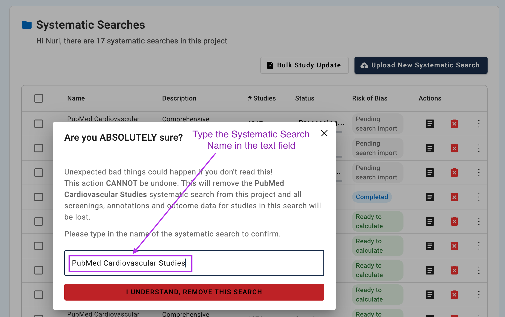

# Study Management

This guide covers how to manage Systematic Searches in your SyRF project. On the Study Management page, project administrators can upload, organize, monitor, and update study references throughout the systematic review process.

## Accessing Study Management

{: .note }
> **Administrator Access Required:** Study Management features are only available to project administrators.

After selecting a project, click on the **Studies** button on the left navigation bar

{: style="border: 2px solid #ccc; padding:10px;"}

then click on **Study Management** to access the administrative interface.

{: style="border: 2px solid #ccc; padding:10px;"}

## An overview of a Typical Workflow

These are the steps in a typical workflow when working with studies:

> **Prepare files for Systematic Search Upload**
>
> Start by preparing your CSV or XML files for upload. Learn about file preparation, deduplication, and format requirements in the [Preparing References](prepare-references.html) guide.

> **Upload Systematic Searches with the prepared files**
> 
> Read the [Systematic Search Upload Process](upload-search.html) for step-by-step instructions on how to upload systematic searches using the CSV or XML files you created.

> **How to add PDFs later?**
>
> Check [PDF Management](manage-pdfs.html) to learn how you can link full-text PDFs to studies to give reviewers access to full text during screening and data extraction. 

> **How to update data for the studies you had uploaded?**
>
> Use [Bulk Study Update](manage-studies.html) to modify existing studies that have been uploaded. This feature is useful for adding or correcting PDF relative path information and custom ID values. Also, you can upload or modify screening decisions made outside of SyRF or correct existing screening decisions.

> **Calculate Risk of Bias**
>
> See [Risk of Bias Assessment](risk-of-bias-assessment.html) for details. DO WE NEED A PAGE??

> **Monitor the background processes**
>
> Review [Monitoring Upload Progress](monitoring-upload-progress.html). DO WE NEED A PAGE??

## What is Study Management?

The Study Management interface provides you with the tools in the workflow described above. The interface contains three main sections:

### 1. Systematic Searches Table
Your primary workspace showing all uploaded searches with:
- **Action buttons**: Upload new searches and bulk update studies
- **Bulk operations**: Select multiple searches for Risk of Bias calculations
- **Progress indicators**: Real-time status updates with clickable links to detailed progress
- **Overflow menu**: View studies, delete systematic searches, run Risk of Bias assessment for a single search, copy the ID of a search

Two main actions in the Systematic Searches table, [Upload Systematic Search](upload-search.html) and [Bulk Study Update](manage-studies.html), have their dedicated pages, so the guides for these are not included here.

The following actions are performed directly within the Systematic Searches table:

**1.1 View Studies in a Systematic Search**

Click the icon marked in the screenshot to view studies.
{: style="border: 2px solid #ccc; padding:10px;"}

This table displays all studies currently imported into your project. You can sort, filter, and search this list. You can also view the PDFs if available.

**1.2 Delete a Systematic Search** 
> **⚠️ Warning:** This action cannot be undone. This will remove the systematic search from this project and all screenings, annotations and outcome data for studies in this search will be lost.

Click the red delete button (trash icon) in the Actions column. 

{: style="border: 2px solid #ccc; padding:10px;"}

This will open the dialog box for confirmation. Type the reseach name into the text field and click delete to finish the process.{: style="border: 2px solid #ccc; padding:10px;"}

**1.3 Run Risk of Bias Assessment**  
To start a Risk of Bias assessment on a search use the checkboxes in the first column. You can select a single search, multiple searches or you can select all the searches . When you make a selection you will see a button with a text that shows the number of selected studies. e.g. "2 selected". Click on the button to get access to run risk of bias assessment.

{: style="border: 2px solid #ccc; padding:10px;"}

{: style="border: 2px solid #ccc; padding:10px;"}

Now click on the "Calculate Risk of Bias for Selected" to start the process.
{: style="border: 2px solid #ccc; padding:10px;"}

Alternatively, you can use the ellipsis menu at the end of each row to start the risk of bias calculation.
{: style="border: 2px solid #ccc; padding:10px;"}

**1.4 Copy Systematic Search ID**  
Click on the ellipsis symbol to access the overflow menu and the button for copying the search ID.
{: style="border: 2px solid #ccc; padding:10px;"}

**1.5 Status Indicators**

Understanding the status indicators in the Systematic Searches table:

*Uploading:* File transfer is currently in progress. This status is clickable and will show detailed progress information when selected.

*Received:* The file has been received and is queued for processing. Click on this status to monitor the processing progress.

*Parsing:* The system is converting your data into SyRF format. This status is clickable to view parsing details.

*Complete:* The upload has successfully finished and the search is ready for use. This status is not clickable as no further action is needed.

*Error:* The upload has failed. Click on this status to view detailed error information that can help troubleshoot the issue.

### 2. Risk of Bias Assessment Monitoring
Track risk of bias assessment processes with detailed progress and error reporting.

TODO: mostly self explanatory, add a screenshot for viewing errors.

### 3. Job Progress Monitoring  
Real-time tracking of background processes including Systematic Serach Uploads, Bulk Study Updates with comprehensive error details.

TODO: mostly self explanatory, add a screenshot for viewing errors, making a search

---

*Need help? Each subsection includes detailed troubleshooting and links to related topics.*
