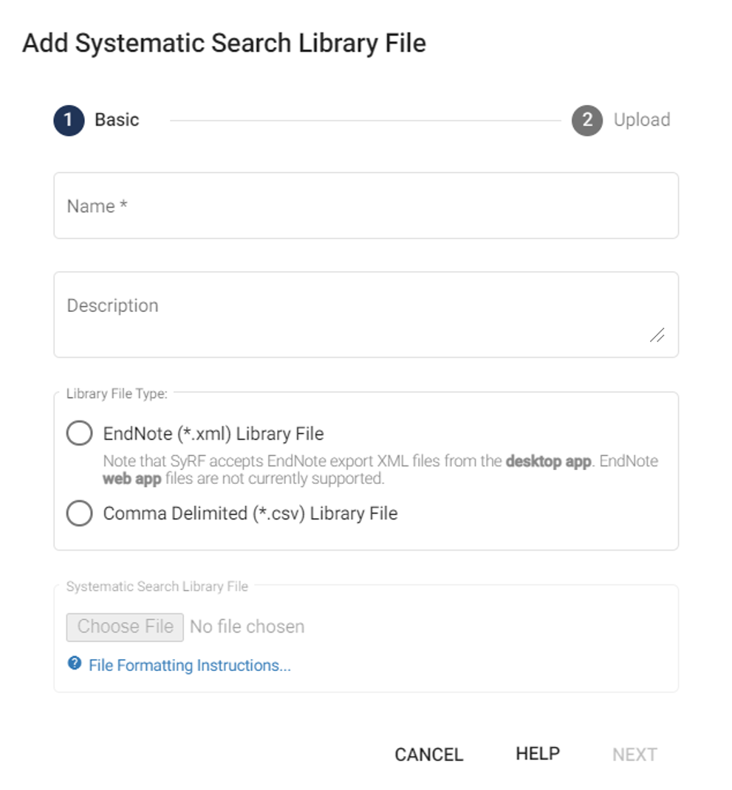
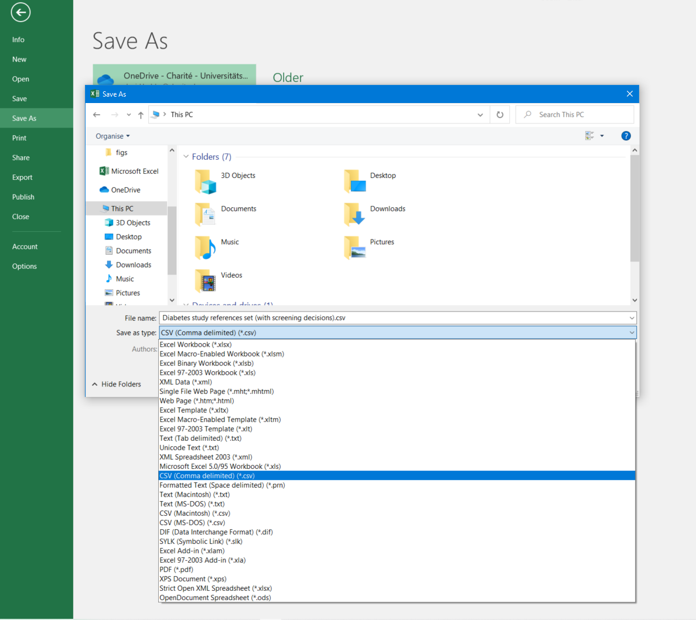

# Systematic Search Upload Instructions

 

[Watch instructional video on YouTube](https://www.youtube.com/embed/e6blmlaPrNA?list=PLT9yacSnQZW85roKzVqoC11OiXm9pob-4)
<!---Link to youtube help video:--->

    <iframe src="https://www.youtube.com/embed/e6blmlaPrNA?list=PLT9yacSnQZW85roKzVqoC11OiXm9pob-4" 
            title="Instructional video on systematic search upload"
            frameborder="0" 
            allow="accelerometer; autoplay; clipboard-write; encrypted-media; gyroscope; picture-in-picture; web-share" 
            allowfullscreen>
    </iframe>

 

## Deduplicating your Systematic Search

If you've searched multiple databases, you may have duplicate studies. Currently, SyRF does not deduplicate studies automatically. Please deduplicate your studies using the [ASySD deduplication tool](https://camarades.shinyapps.io/RDedup/) before uploading.

## Uploading Files

A Project Administrator can upload a systematic search by selecting **Systematic Searches** in Project Settings, then clicking **"Upload New Systematic Search"**.

Accepted file formats:

- **EndNote XML** (EndNote Desktop only; EndNote Web XML is not supported)
- **CSV (Comma-separated values)**

### EndNote XML

*Without screening decisions (currently not supported)*

1. Import references into EndNote.
2. Retrieve full-text PDFs by selecting all references (`Ctrl + A`) and clicking `References → Find Full Text`.
3. Select all references (`Ctrl + A`), then click `File → Export`.
4. Set file type to XML.
5. Name and save the XML file for uploading.

### Zotero Export

Zotero's 'EndNote XML' export option isn't compatible. Use CSV format and follow CSV instructions.

**Having issues with EndNote XML uploads?** See [FAQ](https://syrf.org.uk/faq).

### CSV Upload Instructions

*Optionally including screening decisions*

Upload study references from a CSV file. Your CSV file **must** include these exact column headings:

| Column Name       | Description                                              |
|-------------------|----------------------------------------------------------|
| **Title**         | Title of the study                                       |
| **Authors**       | Authors separated by semicolons, e.g., `Smith J; Doe A`  |
| **PublicationName** | Journal or publication name                              |
| **AlternateName** | Alternative name(s) for the study (if any)               |
| **Abstract**      | Study abstract                                           |
| **Url**           | Web link to the study (if available)                     |
| **AuthorAddress** | Corresponding author's address                           |
| **Year**          | Publication year, format: `YYYY` (e.g., `2023`)          |
| **Doi**           | Digital Object Identifier                                |
| **ReferenceType** | Reference type (e.g., journal article, book)             |
| **Keywords**      | Relevant keywords separated by semicolons                |
| **PdfRelativePath** | Relative path to associated PDF                          |
| **CustomId**      | Optional identifier used externally which will be included in SyRF data exports|

Download a correctly formatted CSV template [here](https://syrf.org.uk/assets/pdfs/Example_systematic_search_upload.csv).

- All columns must be present; empty fields are acceptable.
- To upload **screening decisions**, include separate columns for each reviewer. Decisions should use `1` for inclusion and `0` for exclusion.
- Only include the above columns and user-specific screening columns. Extra columns or missing required columns will cause upload errors.
- Save files as CSV - Comma delimited (`*.csv`) in Excel (`File → Save As`).

## Uploading Full-Text PDFs

Retrieve full-text PDFs **before** uploading references. PDFs cannot be added retroactively.

Ensure the `PdfRelativePath` column contains relative paths matching your uploaded folder structure.

More info on relative paths: [EndNote guide](https://support.clarivate.com/Endnote/s/article/EndNote-Attaching-PDF-files-in-EndNote-desktop-library?language=en_US).

Send the following to [SyRF Helpdesk](mailto:helpdesk@syrf.org.uk):

- Project name
- PDF folder (via Google Drive or similar)
- CSV with PDF paths and corresponding study titles or SyRF study IDs

### PDF File Naming

Avoid invalid filename characters (`< > : " \ / | ? *`). Use unique identifiers (e.g., `RecordID`).

More details: [EndNote's renaming guide](https://support.clarivate.com/Endnote/s/article/Rename-PDFs-in-EndNote?language=en_US).

**Performing a two-stage screening and need PDFs only for included studies?** See [FAQ](https://syrf.org.uk/faq).

## Viewing Studies

View uploaded studies by clicking `Studies → All Studies` in the left navigation panel.

## Deleting Systematic Searches

You can delete systematic searches, but be aware this also deletes all associated screening decisions and annotations.

