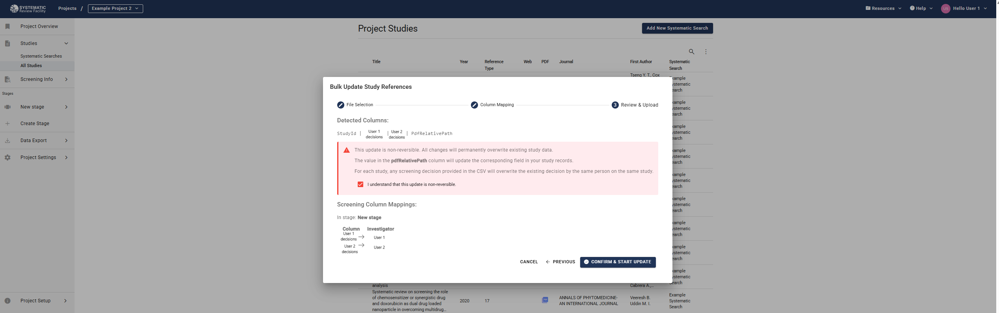

# Managing Study References as a Systematic Search

This guide walks you through managing literature search results within your SyRF project. In SyRF, references identified from your searches (e.g., from databases like PubMed, Embase, Scopus) are grouped and uploaded as units called **Systematic Searches**. We cover the essential steps from preparation to post-upload management:

* **Preparing References:** Includes crucial deduplication steps and choosing the correct file format (EndNote XML or CSV), detailing the required fields.
* **Uploading:** How to add your prepared Systematic Search file to your SyRF project.
* **Managing Full-Text PDFs:** Explains how to link references to their PDFs using relative paths, best practices for file naming, and the process for providing the actual PDF files to the SyRF team.
* **Post-Upload Actions:** Covers how to view your uploaded studies, modify existing study data (including PDF paths, custom IDs, and screening decisions) using the Bulk Update feature, and how to delete entire Systematic Searches if necessary.

A project can contain multiple Systematic Searches, allowing you to manage results from different search strategies or updates over time.

 

    <iframe src="https://www.youtube.com/embed/e6blmlaPrNA?list=PLT9yacSnQZW85roKzVqoC11OiXm9pob-4"
            title="SyRF Guide: Uploading a Systematic Search"
            frameborder="0"
            allow="accelerometer; autoplay; clipboard-write; encrypted-media; gyroscope; picture-in-picture; web-share"
            allowfullscreen>
    </iframe>

---

**Contents**

* TOC
{:toc}

---

## Step 1: Prepare Your References Before Upload

Before uploading your references to SyRF, perform these essential preparation steps:

### 1.1 Deduplicate Your Search Results

If you searched multiple databases, your combined results likely contain duplicate references for the same study.

> **Important:** SyRF does **not** perform deduplication during the upload process. You **must** remove duplicates *before* creating your upload file. Failure to do so will result in multiple entries for the same study within SyRF, complicating your screening process.

* **Recommended Tool:** We strongly recommend using the free [ASySD deduplication tool](https://camarades.shinyapps.io/ASySD/) to automate this crucial step. Other reference management software (like EndNote) also offers deduplication features.

### 1.2 Choose and Prepare Your Upload File Format

SyRF accepts two file formats for uploading your deduplicated references:

* **EndNote Desktop XML (`.xml`):** Recommended if you manage your references primarily in EndNote Desktop.
* **Comma Separated Value (`.csv`):** A flexible format suitable for spreadsheets or exports from other reference managers (like Zotero). **This format also allows the optional inclusion of pre-existing screening decisions.**

#### Option A: Using EndNote XML (`.xml`)

> **Compatibility:** SyRF only accepts XML files exported directly from **EndNote Desktop**. XML files exported from EndNote Web or other software are **not** compatible.

Follow these steps to export from EndNote Desktop:

1. **Import & Finalize:** Ensure all deduplicated references for this Systematic Search are in your EndNote library.
2. **(Optional) Find Full Text:** To attach PDFs within EndNote *before* exporting, select the relevant references (e.g., `Ctrl`+`A` or `Cmd`+`A` for all), then go to `References` -> `Find Full Text`. (See [Uploading Full-Text PDFs](#step-3-uploading-full-text-pdfs) for details on how SyRF handles PDFs).
3. **Select References:** In your EndNote library, highlight *all* references you intend to upload (`Ctrl`+`A` or `Cmd`+`A`).
    > **Warning:** If no references are selected, EndNote might only export the *first* reference in your library, leading to an incomplete upload.
4. **Export:** Go to `File` -> `Export`.
5. **Configure Export Settings:**
    * Set `Save as type` (Windows) or `Format` (Mac) to `XML (*.xml)`.
    * Ensure the `Output style` is set to `Show All Fields` or a similarly comprehensive style to include maximum data.
6. **Save:** Name your file (e.g., `ProjectName_Search_Date.xml`) and save it. This `.xml` file is ready for upload.

> **Using Zotero?**
> You *cannot* use Zotero's 'EndNote XML' export option. If using Zotero, please export your library as a CSV file and follow the instructions in Option B below.

> **XML Upload Error?**
> Refer to the [SyRF FAQ](https://syrf.org.uk/faq) for troubleshooting common XML upload issues.

#### Option B: Using a Spreadsheet CSV (`.csv`) (With Optional Screening Decisions)

> **Note:** This option is recommended if you are not using EndNote or if you want to include pre-existing screening decisions in your upload.

You can prepare your reference list using spreadsheet software (like Microsoft Excel, Google Sheets, LibreOffice Calc) and save it as a `.csv` file.

1. **Create Your Spreadsheet:** Open a new or existing spreadsheet.
2. **Required Column Headings:** Your spreadsheet **must** include the following column headings exactly as spelled and cased. Include all columns, even if you don't have data for every field for every reference.

    | Column Name       | Description                                              |
    |-------------------|----------------------------------------------------------|
    | **Title**         | Title of the study                                       |
    | **Authors**       | Authors separated by semicolons, e.g., `Smith J; Doe A`  |
    | **PublicationName** | Journal or publication name                              |
    | **AlternateName** | Alternative name(s) for the study (if any)               |
    | **Abstract**      | Study abstract                                           |
    | **Url**           | Web link to the study (if available)                     |
    | **AuthorAddress** | Corresponding author's address                           |
    | **Year**          | Publication year, format: `YYYY` (e.g., `2023`)          |
    | **Doi**           | Digital Object Identifier                                |
    | **ReferenceType** | Reference type (e.g., journal article, book)             |
    | **Keywords**      | Relevant keywords separated by semicolons                |
    | **PdfRelativePath** | Relative path to associated PDF                          |
    | **CustomId**      | Optional identifier for your own reference to be included in SyRF data exports|

    >**Download Template:** A template CSV file with the correct headings and example data is available: [Download CSV Template](https://syrf.org.uk/assets/pdfs/Example_systematic_search_upload.csv)

3. **Populate Data:** Fill in the reference details under the corresponding headings.
    ***Empty Fields:** It's acceptable to have empty cells if data is missing for a particular reference. **Do not delete the columns themselves.**
4. **(Optional) Include Pre-existing Screening Decisions:**
    * If screening was partially done outside SyRF, you can import these decisions.
    *Add a **separate column** for *each screener* whose decisions you want to import.
    * **Name these columns descriptively** (e.g., `Screener_Alice_TitleAbstract`, `Screener_Bob_FullText`). You'll map these to SyRF users during the upload.
    *Use `1` for **inclusion** and `0` for **exclusion** in these columns. Leave cells blank if no decision was recorded for that screener/study; they will be ignored.
5. **Remove Extra Columns:** Ensure your file *only* contains the required columns listed above, plus any optional screening decision columns. Extraneous columns can cause errors or invalid data during upload.
6. **Save as CSV:**
    * In your spreadsheet software, choose `File` -> `Save As` or `File` -> `Download`.
    * Select the file type **CSV (Comma delimited) (\*.csv)** or **CSV (Comma Separated Values) (\*.csv)**. Encoding should typically be UTF-8 if prompted.

    

---

## Step 2: Upload the Systematic Search File to Your Project

Only **Project Administrators** can upload new Systematic Searches.

1. Navigate to the desired project within SyRF.
2. In the left-hand project navigation panel, expand the **Studies** section.
3. Click on **Systematic Searches**.
4. Click the **+ Upload New Systematic Search** button.

    

5. **Select File:** In the dialog box that appears, click **Choose File** and select the prepared `.xml` or `.csv` file from your computer.
6. **Upload:** Click the **Upload** button. SyRF will process the file. This may take a few moments depending on the file size.
7. **Confirmation:** Upon successful upload, the new Systematic Search will appear in the list on the **Systematic Searches** page, and the included studies will be added to your project's **All Studies** list.

---

## Step 3: Uploading Full-Text PDFs (Optional but Recommended)

You can link full-text PDFs to the studies in SyRF. This allows reviewers to access the full text directly during screening or data extraction. PDFs are linked using the `PDFRelativePath` field/column in your upload file and then uploaded separately to SyRF storage.

### 3.1 Linking PDFs via the `PDFRelativePath` Field

1. **Organize PDFs:** Create a main folder on your computer to hold all the PDF files for this Systematic Search. You can organize PDFs into subfolders within this main folder if desired (e.g., `MyProject_PDFs/Included/Smith_2020.pdf`).
2. **Determine Relative Paths:** For each reference in your `.xml` or `.csv` file that has a corresponding PDF, you need to specify its path *relative* to the main PDF folder you created.
    * The `PDFRelativePath` field/column must contain this relative path.
    * *Example:* If your main folder is `MyProject_PDFs` and a PDF is located directly inside it named `Jones_2021.pdf`, the `PDFRelativePath` is `Jones_2021.pdf`.
    * *Example:* If the PDF is in a subfolder `SubfolderA` within the main folder, named `Bloggs_2019.pdf`, the `PDFRelativePath` is `SubfolderA/Bloggs_2019.pdf`. Use forward slashes `/` as separators.
    * **EndNote Users:** EndNote can manage relative paths. Ensure your EndNote settings correctly store relative paths if you intend to use this feature. See [EndNote's guide on file attachments](https://support.clarivate.com/Endnote/s/article/EndNote-Attaching-PDF-files-in-EndNote-desktop-library?language=en_US) for details on relative vs. absolute paths.
3. **Ensure Consistency:** The folder structure on your computer *must exactly match* the relative paths specified in your upload file. The filename (including extension `.pdf`) must also match precisely.

### 3.2 Sending PDFs to SyRF

**This is a separate, manual step required after uploading your reference file.**

1. **After** successfully uploading your `.xml` or `.csv` file containing the `PDFRelativePath` information:
2. **Compress:** Compress the *entire main PDF folder* (the one containing all your PDFs and subfolders, matching the structure used for relative paths) into a single compressed file (e.g., `.zip`, `.7z`).
3. **Share:** Upload this compressed folder to a secure file-sharing service (e.g., Google Drive, Dropbox, OneDrive, institutional file share).
4. **Notify SyRF:** Email the SyRF Helpdesk ([helpdesk@syrf.org.uk](mailto:helpdesk@syrf.org.uk)) with the following information:
    * Your SyRF **Project Name**.
    * A **shareable link** to the compressed folder containing your PDFs. Ensure the link provides access permission to the SyRF team.
    * Confirmation that your recently uploaded Systematic Search file (`.xml` or `.csv`) includes the correct `PDFRelativePath` data matching the structure in the compressed folder.

The SyRF team will then process your request, upload the PDFs to secure storage, and link them to the corresponding studies in your project using the relative paths provided. Once processed, linked PDFs can be opened directly from the study review page within SyRF.

### 3.3 PDF File Naming Conventions and Best Practices

* **Avoid Invalid Characters:** Do not use the following characters in your PDF filenames as they can cause issues with storage and linking: `< > : " \ / | ? *`
* **EndNote Default Naming:** Be aware that EndNote's default PDF renaming often uses fields like Author, Year, Title, which might introduce invalid characters (like colons). Consider configuring EndNote to rename PDFs using a unique and clean field, such as `RecordID`, to avoid potential problems. See [EndNote's guide on renaming PDFs](https://support.clarivate.com/Endnote/s/article/Rename-PDFs-in-EndNote?language=en_US).

### 3.4 Handling PDFs for Multiple-Stage Reviews

If you only need full-text PDFs for studies that pass an initial title/abstract screen, follow this workflow:

1. **Initial Upload:** Upload your Systematic Search `.xml` or `.csv` file **without** filling in the `PDFRelativePath` field (leave it blank or omit PDF information).
2. **First Stage Screening:** Perform title and abstract screening within SyRF.
3. **Identify Relevant Studies:** Determine which studies have passed the first stage and require full-text review.
4. **Gather PDFs:** Obtain the full-text PDFs only for these selected studies. Organize them into a folder structure as described above.
5. **Update Paths via Bulk Update:** Use the [Bulk Study Update feature](#using-the-bulk-study-update-feature) (detailed below) to add the correct `PDFRelativePath` information *only* for these specific studies. You will need their SyRF `studyId`s.
6. **Send PDFs:** Compress the folder containing *only these relevant PDFs* and [send the link to the SyRF Helpdesk](#32-sending-pdfs-to-syrf) as described previously.

This targeted approach ensures PDFs are available when needed for full-text review, annotation, or data extraction stages.

---

## Step 4: Viewing Uploaded Studies

Once your Systematic Search file is successfully uploaded, the references are added as studies to your project.

1. In the left-hand navigation panel, click **Studies**.
2. Select **All Studies**.

This table displays all studies currently imported into your project, including those from the latest upload. You can sort, filter, and search this list.

---

## Step 5: Managing Studies Post-Upload

### 5.1 Using the Bulk Study Update Feature

This powerful feature allows Project Administrators to modify data for *existing* studies in bulk *after* they have been uploaded. It's useful for:

* Adding or correcting `PDFRelativePath` information (e.g., for the two-stage PDF workflow).
* Adding or correcting `CustomID` values.
* Uploading or modifying screening decisions made outside of SyRF (or correcting existing ones).

**How to Access Bulk Update:**

1. Navigate to **Studies** -> **All Studies**.
2. Click the **three dots icon** (...) located next to the search magnifying glass above the study list.
3. Select **Bulk study update...** from the dropdown menu.

    

**Preparing Your Update File (CSV):**

1. **Create a CSV File:** You'll need a new CSV file specifically for the update.
2. **Required `studyId` Column:** This file **must** include a column named exactly `studyId`. Each row should contain the unique SyRF `studyId` of a study you wish to update.
    * **How to get `studyId`s:** The easiest way is to export your current study data from SyRF. Go to `Data Export` -> `Bibliographic`. **Untick** the option "SyRF systematic search import compatible format". Click `DOWNLOAD DATA`. The exported CSV file will contain the `studyId` column along with other bibliographic data.
3. **Include Only Columns to Update:** Besides `studyId`, your update file should *only* contain columns for the data you intend to change. For example:
    * `pdfRelativePath`
    * `customId`
    * Columns for screening decisions (e.g., `Screener_Alice_TitleAbstract`, `Screener_Bob_FullText`).
    * **Important:** Remove all other bibliographic columns (`Title`, `Authors`, `Year`, etc.) from the file you exported to get the `studyId`s. Only keep `studyId` and the columns you are actively updating.
4. **Enter Update Values:**
    * **For `pdfRelativePath` or `customId`:** Enter the new value in the corresponding cell for each `studyId` you want to modify.
        > **Warning:** Providing an empty/blank cell for `pdfRelativePath` or `customId` in the update file *will erase* any existing value for that field in SyRF for that study. Only include rows and provide values for studies you intend to change.
    * **For Screening Decisions:**
        * Use column names you can recognise (you'll map them later).
        * Use `1` for inclusion and `0` for exclusion.
        * **Note:** Blank cells in screening decision columns are *ignored* during the update; they will *not* erase existing decisions. However, providing a `1` or `0` will *overwrite* any previous decision made by the *same mapped user* for the *same study* across ***any*** screening stage.

**Upload and Mapping Process:**

1. **Choose File:** In the "Bulk study update" dialog, select your prepared CSV update file.
2. **Column Mapping:**
    * SyRF will display the columns it detected in your CSV. Review this list carefully. If unexpected columns appear, cancel the upload, correct your CSV file, and try again.
    * If you included screening decision columns, you **must** map each one to the corresponding **Project Member** and the relevant **Screening Stage** (e.g., Title/Abstract, Full Text).

    

3. **Review and Confirm Upload:**
    * A final confirmation screen summarizes the detected columns and the screening decision mappings you've made.
    * **Read the warnings on this page very carefully before proceeding.**

    > **Critical Warnings for Bulk Update:**
    >
    > * **Irreversible Action:** Bulk updates **cannot be undone**. Changes made are permanent. Double-check your update file and mappings.
    > * **Overwriting Data (`pdfRelativePath`, `customId`):** Any data present in your update file for these columns *will overwrite* the current data in SyRF for the specified `studyId`.
    > * **Erasing Data (`pdfRelativePath`, `customId`):** Providing a *blank cell* for these columns in your update file *will permanently delete* any existing data for that field in SyRF.
    > * **Screening Decisions:** Decisions (`1` or `0`) in your update file *will overwrite* existing decisions made by the *same user* for the *same study* and *same stage*. Blank cells in screening columns are *ignored* and do not erase existing decisions.

    * If everything is correct, confirm the upload.

    

### 5.2 Deleting an Entire Systematic Search Upload

Project Administrators can remove an entire Systematic Search upload and all associated data from the project.

**How to Delete:**

1. Navigate to **Project Settings** (usually accessed via a gear icon or link in the project header or navigation).
2. Find the section related to **Systematic Searches** or **Data Management**. *[Note: Exact location might vary slightly based on SyRF version - adjust if needed]*. Look for a list of uploaded Systematic Searches with a delete option.
3. Locate the Systematic Search you wish to delete and use the corresponding delete button/icon.

> **Extreme Warning: Deletion is Irreversible**
>
> Deleting a Systematic Search is a **permanent action** and **cannot be undone**. This action will remove:
>
> * All studies that were part of that specific upload.
> * All screening decisions (title/abstract, full text) associated with those studies.
> * All data extraction/annotation answers associated with those studies.
>
> **Exercise extreme caution before deleting a Systematic Search. Ensure you are removing the correct item and understand the consequences.**

---
