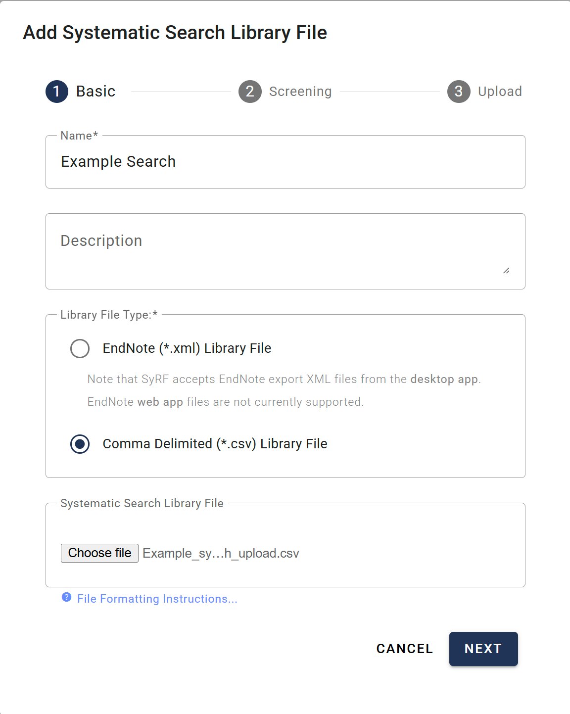
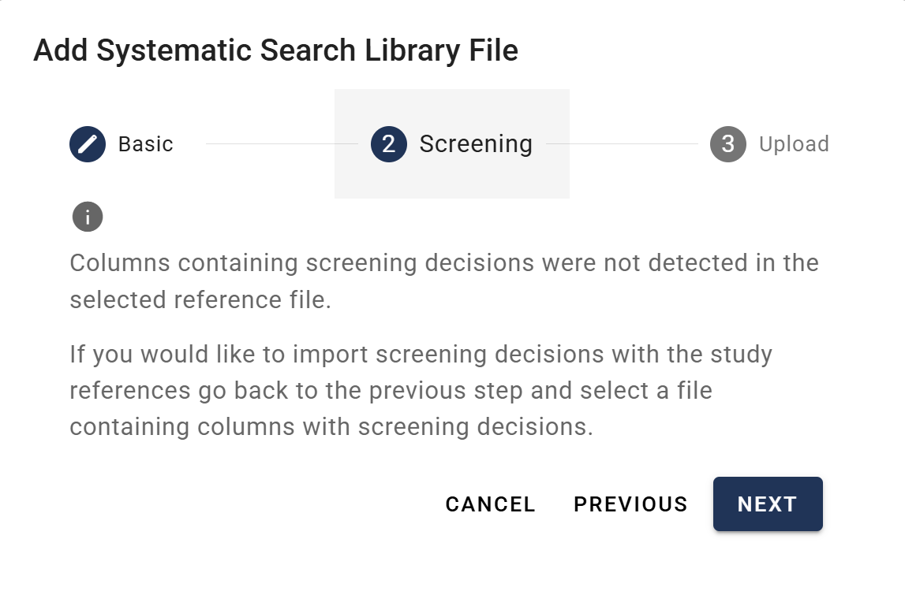
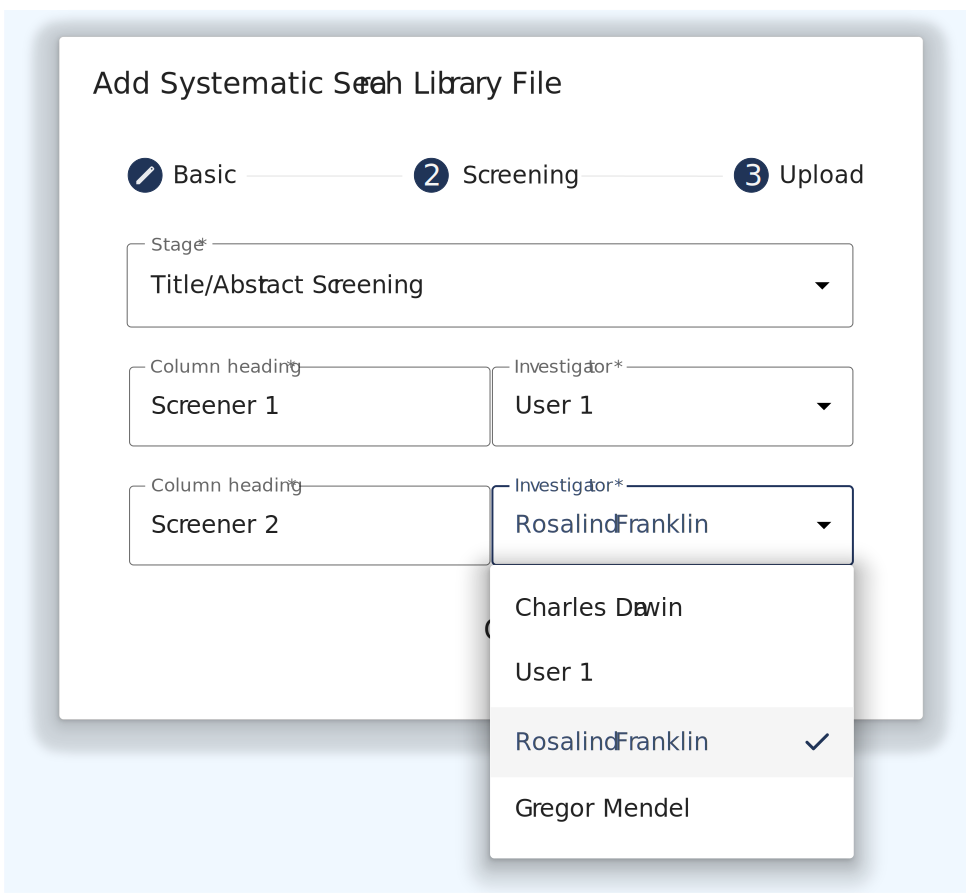
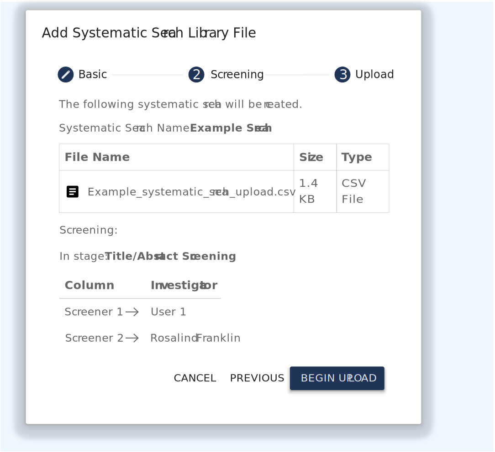

# Upload Process

Only **Project Administrators** can upload new Systematic Searches. The upload process follows a wizard to guide you through importing your reference file. This is a **three-step** process for `.csv` files (Basic, Screening, and Upload) and a **two-step** process for `.xml` files (Basic and Upload, as the screening step is skipped).

**Contents**

* TOC
{:toc}

---

## Getting Started

1. Navigate to the desired project within SyRF.  
2. In the left-hand project navigation panel, expand the **Studies** section.  
3. Click on **Study Management**.  
4. Click the **Upload New Systematic Search** button to launch the wizard.
{: style="border: 2px solid #ccc; padding:10px;"}

## Wizard Step 1: Basic Information

In the first step, you will provide essential details about your search and select your file

1. **Name:** Enter a descriptive name for your Systematic Search (e.g., "Embase Search May 2024"). This field is required.
2. **Description:** (Optional) Add any relevant details about the search strategy or its contents.  
3. **Library File Type:** Select either EndNote (\*.xml) Library File or Comma Delimited (\*.csv) Library File to match the file you prepared.  
4. **Systematic Search Library File:** Click **Choose File** and select the prepared .xml or .csv file from your computer.  
5. Click **NEXT** to proceed.

## Wizard Step 2: Screening (CSV Uploads Only)

This step allows you to map pre-existing screening decisions from your CSV file to project members and screening stages in SyRF.

**Note:** This step is skipped if you are uploading an EndNote .xml file.

* **If your CSV file does not contain screening columns:** SyRF will inform you that no screening columns were detected. You can simply click **NEXT** to continue to the final step.

    

* **If your CSV file contains screening columns:** You must map them before proceeding.

    
    
    1. **Stage:** Select the screening stage to which the decisions apply (e.g., Title/Abstract Screening, Full Text Screening).  
    2. **Map Columns to Investigators:** For each screening column detected in your file, SyRF will display the **Column heading**. From the adjacent **Investigator** dropdown menu, select the Project Member who made those decisions.  
    3. Once all columns are mapped, click **NEXT**.

## Wizard Step 3: Upload

This is the final confirmation step.

1. **Review Details:** Carefully review the summary, which includes:  
   * The **Systematic Search Name** you provided.  
   * The **File Name**, **Size**, and **Type** of the file you are uploading.  
   * A summary of the **Screening** mappings, showing which column is being mapped to which investigator for the selected stage.  
2. **Begin Upload:** If all the information is correct, click **BEGIN UPLOAD**.

SyRF will now process and import your file. This may take a few moments depending on the number of references.

Upon successful upload, the new Systematic Search will appear in the list on the **Systematic Searches** page, and the included studies will be added to your project's **All Studies** list.

---

## Video Guide

 

    <iframe src="https://www.youtube.com/embed/e6blmlaPrNA?list=PLT9yacSnQZW85roKzVqoC11OiXm9pob-4"
            title="SyRF Guide: Uploading a Systematic Search"
            frameborder="0"
            allow="accelerometer; autoplay; clipboard-write; encrypted-media; gyroscope; picture-in-picture; web-share"
            allowfullscreen>
    </iframe>

---

## Next Steps

After uploading your search, you may want to:

* **[Add PDFs](manage-pdfs.html)** - Link full-text PDFs to your uploaded studies
* **[View Studies](view-studies.html)** - See your uploaded studies in the project
* **[Manage Studies](manage-studies.html)** - Make bulk updates or corrections if needed
